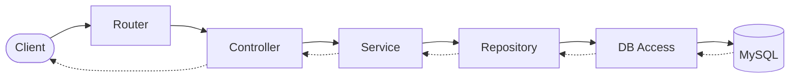
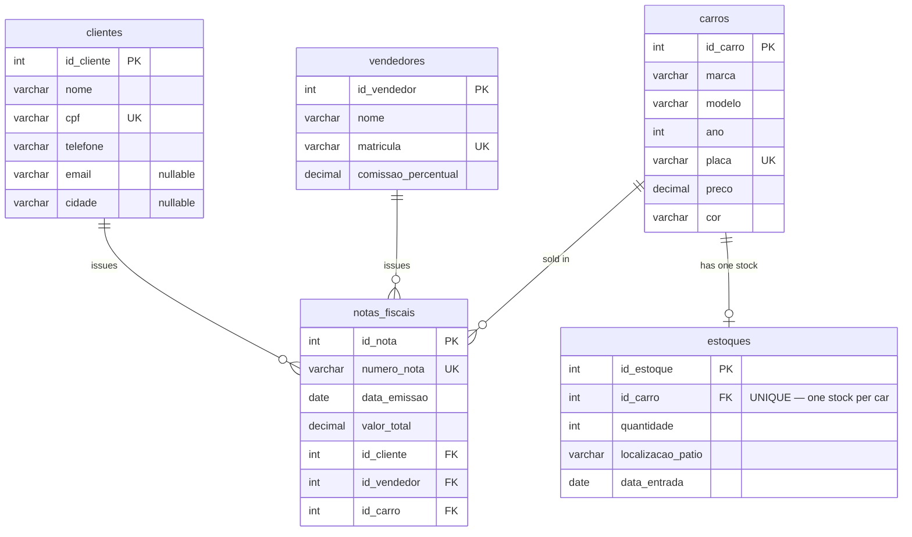

# Architecture — DriveFlow API

A REST API for managing a car dealership (clients, salespeople, cars, stock and
invoices). It is built with a strict layered MVC architecture on top of a MySQL
relational database. This document explains **how the system is structured** and,
more importantly, **why each technical decision was made**.

> Academic context: this is the second phase of a college project. Phase I used
> in-memory arrays; Phase II replaces that volatile storage with MySQL while keeping
> the business rules unchanged.

---

## Tech stack

| Concern | Choice |
|---|---|
| Language | TypeScript (strict mode) |
| Runtime | Node.js |
| HTTP framework | Express |
| Database | MySQL 8 |
| DB driver | `mysql2` (connection pool) |
| Config | `dotenv` (`.env`) |
| Infrastructure | Docker / Docker Compose |

---

## Project structure

```
src/
├── app.ts                 # bootstraps DB then starts the server
├── database/
│   └── mysql.ts           # pool, executeQuery, setupDatabase
├── routes/
│   └── router.ts          # all routes in one place
├── models/                # domain classes 
├── repositories/          # SQL per entity (Singleton)
├── services/              # business rules (RN01–RN06)
├── controllers/           # HTTP I/O and status codes
└── errors/                # AppError + typed error classes
```

---

## Layered architecture

The application is organized in layers with a **single direction of dependency**:
each layer has a single responsibility and only knows the layer directly beneath it.
A request flows down through the layers and the response flows back up.



| Layer | Responsibility | Does **not** |
|---|---|---|
| **Router** (`routes/router.ts`) | Map HTTP verb + path to a controller function | Contain logic |
| **Controller** | Parse request, call the service, translate result/errors into HTTP status codes (200/201/400/404/409/422) | Hold business rules or touch the DB |
| **Service** | Enforce business rules, orchestrate repositories, validate input | Build HTTP responses or write SQL |
| **Repository** | Execute SQL and map rows to domain objects; Singleton per entity | Hold business rules |
| **Database access** (`database/mysql.ts`) | Own the connection pool, expose `executeQuery`, create tables on startup (`setupDatabase`) | Know about specific entities' rules |

The request chain is **asynchronous**: database access returns a `Promise`, so the
controller, service and repository layers are `async`. Errors propagate as exceptions
up to the controller, which converts them into HTTP responses using typed error classes
(see Design Decision #2).

---

## Database schema

Five tables. Primary keys are `AUTO_INCREMENT`; uniqueness and referential integrity
are enforced by the database (`UNIQUE`, `FOREIGN KEY`) in addition to the service layer.



- `cpf`, `matricula`, `placa`, `numero_nota` are **UNIQUE** (RN01/02/03/05).
- `estoques.id_carro` is **UNIQUE** → a car has at most one stock record (RN04).
- Monetary values use `DECIMAL` (exact precision); dates use `DATE` (no time component).

---

## Design decisions

Each decision is described with its **context**, the **decision** taken, and its
**consequences** (what was gained and what was traded off).

### 1. Single database access point with a connection pool

- **Context:** every repository needs to run SQL. Spreading raw `pool.query` calls
  across the codebase couples all repositories to the driver's API; and a single
  connection would serialize every query and need manual reconnection if it dropped.
- **Decision:** expose one generic function, `executeQuery(sql, values)`, in
  `database/mysql.ts`, backed by a `mysql.createPool`. Every repository goes through
  it, always using **parameterized queries** (`?` placeholders).
- **Consequences:** SQL injection is prevented by default (values are data, never
  concatenated); concurrent requests borrow separate pooled connections, and dead ones
  are recycled automatically. Because all access is funneled through `executeQuery`,
  the driver and pool are isolated behind one function — switching from a single
  connection to a pool touched **only** `database/mysql.ts`. Trade-off: a thin layer of
  indirection and an `any` return type (could be typed with
  `RowDataPacket`/`ResultSetHeader`).

### 2. Typed error classes with centralized HTTP mapping

- **Context:** errors were thrown as generic `Error('message')`, and each controller
  mapped them to status codes by comparing the message string — repetitive and
  fragile (rewording a message silently broke its status), and any unmapped error
  defaulted to `400`, mislabeling real server failures as client errors.
- **Decision:** introduce an `AppError` base class that carries an HTTP `status`, with
  subclasses `ValidationError` (400), `NotFoundError` (404), `ConflictError` (409) and
  `BusinessError` (422). Services throw the typed error; controllers catch it and, when
  it is an `instanceof AppError`, respond with `error.status` and `error.message`.
  Anything that is not an `AppError` is treated as unexpected and returns `500`.
- **Consequences:** the status travels with the error, so there is no string matching
  and the mapping lives in one place. Adding a new error type requires no controller
  change, and unexpected failures (a bug, the database down) now correctly return `500`
  instead of `400`. The HTTP status is decided in the domain layer (where the rule
  lives), while the controller stays a thin translator. (`src/errors/AppError.ts`)

### 3. No transaction on emission — an accepted trade-off

- **Context:** issuing an invoice performs two writes: insert the invoice, then
  decrement stock. Ideally both succeed or both roll back.
- **Decision:** run the two statements sequentially (no explicit transaction). Stock
  decrement is **atomic** at the SQL level:
  `UPDATE estoques SET quantidade = quantidade - 1 WHERE id_carro = ? AND quantidade > 0`.
- **Consequences:** the atomic update prevents negative stock, which covers the main
  risk. A true transaction would be the production-grade solution; it was kept simple
  to match the course scope.

### 4. Data-type mapping with `mysql2`

- **Context:** by default `mysql2` returns `DATE` columns as JavaScript `Date` objects
  — which serialize to a UTC ISO timestamp and can shift the date by one day depending
  on the server timezone — and `DECIMAL` columns as strings (to preserve exact
  precision). Neither matches the API's date/number contract directly.
- **Decision:** keep columns as `DATE` and enable `dateStrings: true` so dates come
  back as plain `"YYYY-MM-DD"` strings (typed `string` end-to-end); convert `DECIMAL`
  fields (`preco`, `valor_total`, `comissao_percentual`) with `Number()` when mapping
  rows. Validation still builds a temporary `Date` to check "not future".
- **Consequences:** responses match the contract exactly — dates as `"2025-06-10"`
  with no timezone shift, and monetary values as numbers — staying consistent between
  `POST` (request body) and `GET` (database).

### 5. Defense in depth: validation in the service **and** constraints in the DB

- **Context:** uniqueness (cpf, plate, …) and referential integrity (an invoice must
  reference existing records) are business rules that can also be enforced by the
  database.
- **Decision:** validate in the service for friendly HTTP errors (409/404/422), and
  also declare `UNIQUE` and `FOREIGN KEY` constraints so the database is the ultimate
  source of truth.
- **Consequences:** the service produces clear messages for the common case; the
  database guarantees integrity even against race conditions. Trade-off: a duplicate
  slipping past the service surfaces as a raw `ER_DUP_ENTRY` which, not being an
  `AppError`, falls through to the generic 500 handler (see Design Decision #2).

### 6. Invoices are immutable — no `PUT`/`DELETE`

- **Context:** RN05 requires historical integrity — invoices cannot be altered or
  removed after emission.
- **Decision:** the invoice module exposes only `GET`, `GET/:id` and `POST`. The
  repository has no `update`/`delete` methods.
- **Consequences:** the design itself encodes the rule; there is no endpoint that
  could violate it.

### 7. `async/await` propagated through the request chain

- **Context:** database access is I/O — it returns a `Promise`. Asynchrony is
  "contagious": a caller of an async function must also be async.
- **Decision:** repositories, services and controllers are all `async`. The value is
  awaited only where it is **used**; when a method merely forwards a `Promise`, it
  returns it without `await` (avoiding a redundant unwrap/rewrap).
- **Consequences:** clean, sequential-looking code. The main hazard is a forgotten
  `await` on a validation that hits the DB: an unhandled rejection crashes the process
  (Node's default). The codebase addresses this by awaiting all DB-backed validations
  and keeping pure (non-DB) validations synchronous.

### 8. Standardized response contracts

- **Context:** Phase II formalized response shapes. `POST`/`PUT`/`DELETE` should
  return the affected resource (with its id), not a generic message.
- **Decision:** services return the created/updated/removed domain object; controllers
  respond with it (`res.status(201).json(resource)`).
- **Consequences:** clients (and the grading test runner) get the generated id
  directly. `INSERT` returns the object via `insertId`; `DELETE` returns the
  previously-fetched record before removal.
